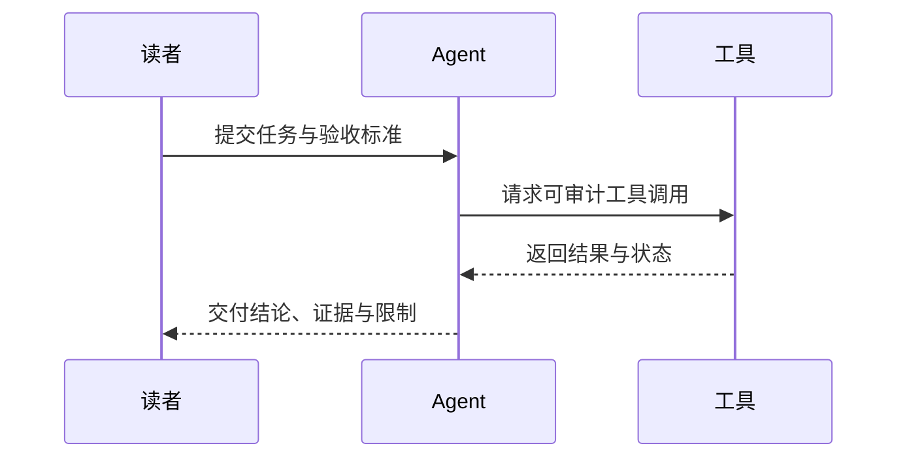

适合表达流程、状态、依赖和决策。页面内图示遵守正文安全边界；复杂细节可以进入居中的无限画布查看。

<MermaidDiagram title="从问题到可复核交付" description="流程图支持页面内适配和全屏画布" chart={`flowchart LR
  A[定义问题] --> B[采集来源]
  B --> C{证据充分?}
  C -->|否| B
  C -->|是| D[生成交付]
  D --> E[人工复核]`} />

## 全屏操作

<Steps>
  <Step>选择图示右上角“展开”，画布会以图形边界为基准居中。</Step>
  <Step>拖动空白处平移；滚轮或触控板围绕指针位置缩放。</Step>
  <Step>使用放大、缩小、适应画布和复位；按 <kbd>Esc</kbd> 退出。</Step>
</Steps>

<ComparisonMatrix title="页面内与全屏画布" columns={['页面内', '全屏']} rows={[
  { dimension: '目标', values: ['快速理解主关系', '检查复杂细节'] },
  { dimension: '尺寸', values: ['受正文安全边界约束', '使用完整视口'] },
  { dimension: '交互', values: ['必要时横向滚动', '拖动、缩放、适应'] },
  { dimension: '降级', values: ['保留源码', '退出后回到触发按钮'] },
]} />

## 推荐图形

<Callout type="warn" title="避免一图承载整篇文章">节点超过一个屏幕仍无法分组时，应拆成总览图与子流程；无限画布用于检查细节，不是逃避信息架构。</Callout>
